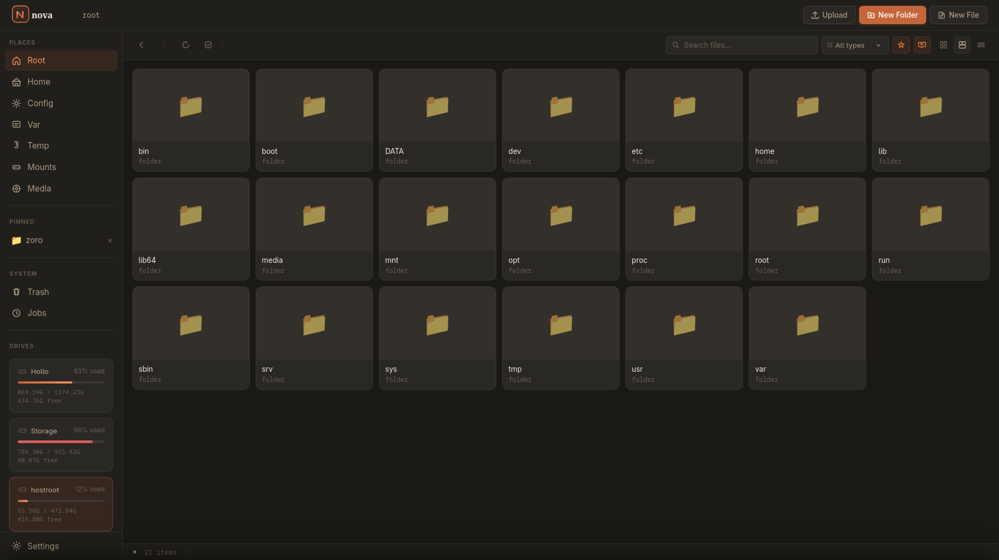
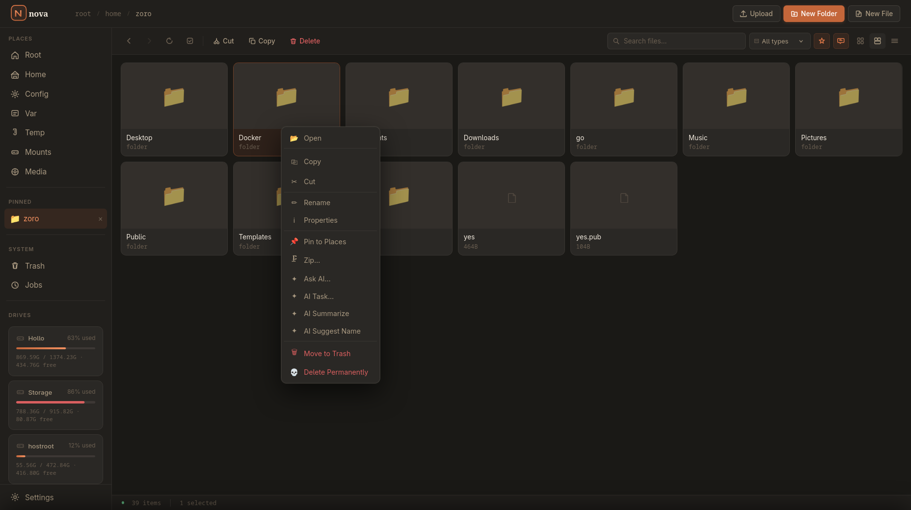
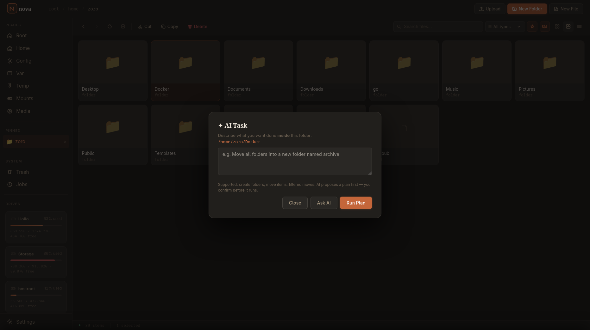

<p align="center">
  
</p>

<p align="center">
  <strong>Your files. Your server. Your rules.</strong><br/>
  A fast, modern, self-hosted file manager built for Docker.
</p>

<p align="center">
  <a href="https://github.com/just-for-death/nova/releases"></a>
  <a href="LICENSE"></a>
  <a href="https://hub.docker.com/r/just-for-death/nova"></a>
  <a href="https://github.com/just-for-death/nova/stargazers"></a>
</p>

<p align="center">
  <a href="#-quick-start">Quick Start</a> ·
  <a href="#-features">Features</a> ·
  <a href="#-ai-features">AI Features</a> ·
  <a href="#%EF%B8%8F-configuration">Configuration</a> ·
  <a href="#-screenshots">Screenshots</a>
</p>

---

## 📸 Screenshots

<p align="center">
  
</p>

<p align="center">
  
  
</p>

<p align="center">
  
</p>

---

## ✨ Features

| Category | What it does |
|----------|-------------|
| **Browse** | Intuitive Grid, Gallery, & List views; breadcrumb nav, semantic search, hidden-file toggle |
| **PWA & Theming** | Fluid, installable Progressive Web App with scalable, context-aware SVGs and a dynamic UI theming engine |
| **Transfer** | Parallel copy/move with live progress tracking, resume, pause & cancel |
| **Conflict resolution** | Per-file collision handling: overwrite / skip / keep-both |
| **Trash** | Safe soft-delete with restore mechanics and permanent delete option |
| **Uploads** | Drag-and-drop resilience; continues actively in the background |
| **Archives** | Create `.zip` and extract multi-format archives directly as background jobs |
| **Editor** | Monospace text editor for 50+ file types with dirty-state tracking |
| **AI (Ollama)** | Summarize content, rename sequences, query image metadata, and an autonomous AI task agent |
| **Settings** | UI to effortlessly manage themes, icon sizing, credentials, Dozzle URLs, and UI scaling |
| **Notifications** | Native Gotify push alerts upon successful completion or failure of background jobs |
| **Logs & Monitor** | Structured JSON logs + an independent sidecar container `nova-monitor` to poll for system interruptions |

---

## 🚀 Quick Start

```bash
# 1. Clone
git clone https://github.com/just-for-death/nova.git
cd nova

# 2. Configure
cp .env.example .env
# Edit .env to set your port, Gotify, Ollama, etc.

# 3. Launch
docker compose up -d

# 4. Open
open http://localhost:9898
```

---

## 🔒 Security & Credentials

Nova secures all persistent sessions inside its native SQLite database, fortifying against CSRF attacks with strict Double-Submit-Token enforcement on all critical API routes.

Upon **first launch**, the backend reads these variables in `docker-compose.yml` to generate your initial secure administrator hash:
```yaml
      - ADMIN_USER=admin
      - ADMIN_PASS=MySecurePassword123!
```

> **IMPORTANT:** 
> These environment variables are *only* read when the database is empty. Once the container successfully secures the initial account, updating these variables in `docker-compose.yml` has no effect. 
> To update your password later, securely alter it via the **Nova UI Settings Panel**.

Nova binds the **entire host filesystem** container path `/hostroot` as `privileged`.
> **Never expose it to the open internet unprotected.** It is intended strictly for local home-labbing or heavily-vetted VPN/Proxy environments!

---

## ⚙️ Configuration

All configuration lives in `.env`:

| Variable | Default | Description |
|---|---|---|
| `HOST_PORT` | `9898` | Host port for the Nova UI |
| `MONITOR_PORT` | `9091` | Health monitor sidecar port |
| `LOG_LEVEL` | `info` | `debug` / `info` / `warn` / `error` |
| `LOG_FORMAT` | `json` | `json` (Dozzle) or `text` (human-readable) |
| `COPY_WORKERS` | `4` | Parallel file copy threads |
| `AUTH_SECRET` | `nova-persistent` | A secure persistent session key mapping |
| `GOTIFY_...` | _(empty)_ | Gotify tokens for mobile push notifications |
| `OLLAMA_URL` | `http://host-gateway:11434` | Ollama semantic reasoning path |

---

## 🤖 AI Features

Nova natively queries a local [Ollama](https://ollama.com) language model pipeline. **All AI actions stay within your host.**

```bash
ollama pull llama3.2:1b          # Text semantic pipelines (renaming, tagging)
ollama pull moondream:latest     # Visual perception framework (images)
ollama pull nomic-embed-text     # Semantic knowledge search
```

Right-click any folder or document to deploy AI models. The **AI Task Agent** actively builds logic roadmaps inside your terminal buffer, giving you full sandbox oversight before executing any filesystem commands.

---

## ⌨ Keyboard Shortcuts

| Key | Action |
|-----|--------|
| `Ctrl+C` | Copy selected |
| `Ctrl+X` | Cut selected |
| `Ctrl+V` | Paste buffer |
| `Ctrl+A` | Select aggregate |
| `Delete` | Move to trash |
| `F5` | Hot reload UI state |
| `Backspace` | Navigate relative backing |
| `Escape` | Dismiss modal |
| `Ctrl+S` | Save Editor payload |

---

## 📦 Architecture

```text
┌──────────────────────────┐     ┌──────────────────┐
│   nova-filemanager       │◄────│   nova-monitor   │
│   Node.js + Express      │     │   health poller  │
│   WebSocket live updates │     │   Gotify alerts  │
│   Port 9898              │     │   Port 9091      │
└────────────┬─────────────┘     └──────────────────┘
             │ bind mount
         /:/hostroot (read-write)
```
- **Backend:** Node.js 20, Express, `ws`, `archiver`
- **Frontend:** HTML5, CSS3 Variables, Vanilla JS (No build pipeline necessary)

---

## License

MIT © [just-for-death](https://github.com/just-for-death)
